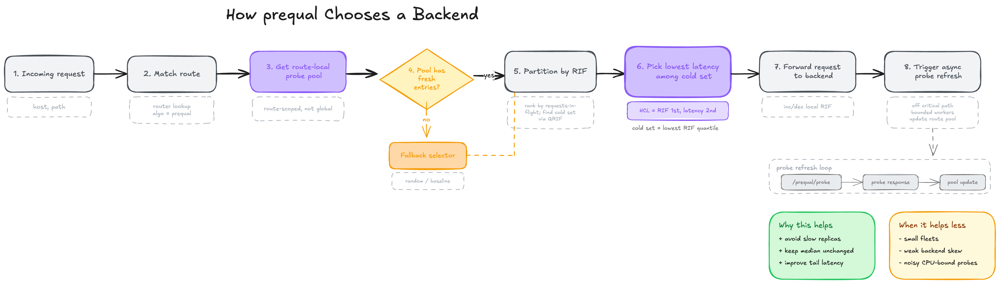
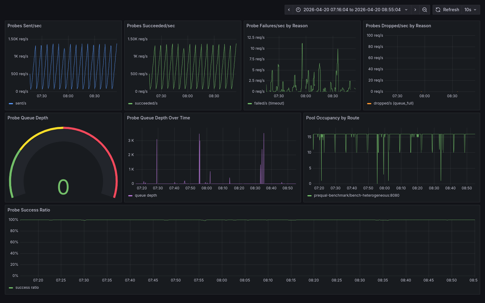

# prequal

A Kubernetes ingress controller that implements the Prequal load-balancing algorithm from NSDI '24, along with the full benchmark trail that got the result out of me.

In the regime the paper describes, this implementation cuts `p99` tail latency by about `10x` compared to `round-robin` and `least-connections`. In a smaller CPU-bound regime it loses by roughly 25% and I didn't try to hide that. The investigation log explains why an early version of the experiment made the algorithm look catastrophically wrong before I fixed the methodology.


The 15 alternating bands are five runs each of `prequal`, `round-robin`, and `least-connections` on the same 16-backend workload. `p50` latency is identical for all three (the fast service time). Only the tail separates: `prequal` sits around `60 ms`, both baselines hover near `800 ms`.

---

## The bounded claim

In the paper-aligned regime (`16` backends, `16x` service-time skew between fast and slow replicas, I/O-bound service time), `prequal` cuts `p99` by `8.6x` on `C2` and `6.8x` on `C3` compared to the best baseline. The result shows up across two cluster topologies on the same host: `E-A` (single-host `kind`, controller sharing a worker with backends) and `E-B` (multi-node `kind`, controller on its own node, backends spread across workers).

The negative side: on a 4-backend CPU-bound workload with closed-loop 30 VUs, `prequal` is roughly 25% slower than round-robin on throughput. That run is in the repo too.

I'm not claiming `prequal` is a universal improvement, I'm not claiming same-host testbed evidence substitutes for cross-infrastructure proof, and I'm not claiming this is a finished production ingress.

The locked-down technical conclusion lives at [`benchmark/REPORT.md`](benchmark/REPORT.md). Longer narrative on my blog: [sathwick.xyz/blog/prequal.html](https://sathwick.xyz/blog/prequal.html). Short public summary on Medium: [I built a custom load balancer in Go — the hardest part wasn't the code](https://medium.com/@sathwick.p7/i-built-a-custom-load-balancer-in-go-the-hardest-part-wasnt-the-code-2774a614a062).


## Headline numbers

### `C2` heterogeneous open-loop, `E-B`, `500` rps, `300s`, 5 reps

| algorithm | p99 ms | p99.9 ms |
|-----------|-------:|---------:|
| **prequal** | **94.20** | **272.38** |
| round-robin | 807.32 | 887.90 |
| least-connections | 802.84 | 1006.78 |

### `C3` heterogeneous ramp, `E-B`, `100→1500` rps, `370s`, 5 reps

| algorithm | p99 ms | p99.9 ms |
|-----------|-------:|---------:|
| **prequal** | **123.39** | **824.08** |
| round-robin | 831.58 | 1250.41 |
| least-connections | 867.93 | 1596.51 |

Per-backend selection data shows the mechanism. `prequal` drives traffic to the 2 slow replicas down to under `0.1` selections per second each, and the 14 fast replicas share the rest.

## How the algorithm works here

`prequal` picks backends from two signals the backends report: requests-in-flight and a median-latency estimate. Selection is hot-cold lexicographic. Within the cold RIF quantile it picks the lowest-latency backend. If everyone is hot, it picks the least loaded.




On a real workload that translates into what the dashboard shows: `prequal` spreads requests across the 14 fast replicas roughly evenly and leaves the slow two out. Round-robin sends `2/16` of traffic into the slow pair, those requests queue to the slow service time, and the tail gets dragged along behind them. Least-connections does better on `p95` because RIF tracking eventually pulls traffic away from slow backends, but anything that arrived before "eventually" still pays the queue cost, and that pins `p99` right next to round-robin's.



`random_fallback_rate` is zero across every `prequal` run in the locked-down campaigns. The pool stays populated and HCL stays in charge; the win isn't the algorithm quietly collapsing into random selection.

## Where `prequal` does not win


`C1` is a small-fleet CPU-bound workload: 4 backends all running a SHA256 loop, driven closed-loop by 30 VUs. The ordering inverts.

| algorithm | throughput rps | p99 ms |
|-----------|---------------:|-------:|
| prequal | 4162 | 29.86 |
| round-robin | 5366 | 20.22 |
| least-connections | 4965 | 23.48 |

`prequal` takes a ~25% throughput hit here and gets a worse tail. I went looking for a hot path in the controller and didn't find one. CPU, mutex, heap were all boring. The probe code itself costs about `5-10 µs` per request, which is noise. The rest of the gap turned out to be probe traffic competing with user requests for the same backend CPU budget, and on I/O-bound backends that competition simply goes away. That's why the pivoted regime wins and this one doesn't. Full profile writeup at [`benchmark/investigations/2026-04-20-prequal-overhead-profiling.md`](benchmark/investigations/2026-04-20-prequal-overhead-profiling.md).

The negative result is in the repo on purpose. `prequal` is regime-specific, not a drop-in improvement.

## What makes this repo different

Most "here's my Prequal implementation" repos publish the algorithm and the happy-path numbers. A few things this one does that most don't.


First, the methodology story is all here. An early 3-rep sequential `C2` run made `prequal` look catastrophically worse than both baselines, 10x worse, in the opposite direction of the paper's claim. The obvious move was to go hunting for bugs in HCL. That would have been the wrong move. The actual cause was pool-state leakage between sequential runs, and the whole trail of competing hypotheses is in [`benchmark/investigations/2026-04-19-c2-tail-spike.md`](benchmark/investigations/2026-04-19-c2-tail-spike.md). The controlled protocol that came out of it (interleaved algorithm order, `kubectl rollout restart` before every run, `15s` warmup) is in [`benchmark/scripts/run_interleaved_campaign.sh`](benchmark/scripts/run_interleaved_campaign.sh). Anyone trying to reproduce this needs that protocol or they'll get garbage.

Second, the result holds across two cluster topologies. `E-A` and `E-B` differ in controller placement and pod spread. On `C2` the advantage ratio shifts from `10.0x` to `8.6x` between them, which is within each environment's own variance. Two same-host topologies isn't cross-infrastructure proof, but it's a real check on cluster-shape artifacts.

And third, the negative runs live next to the positive ones. `C1` is graphed, the initial failing uncontrolled runs still sit under their original timestamps, and the overhead investigation has its own closed log. Nothing that fell over has been swept out of the repo.

## Reproduce it

Prerequisites: Go `1.22+`, Docker, `kubectl`, `kind`, `k6`.

```bash
# 1. Create the E-B cluster shape (1 control-plane with extraPortMappings, 2 workers).
kind create cluster --name kind --config benchmark/kind-config-e-b.yaml

# 2. Build and load the controller and backend images into kind.
make docker-build
make kind-load
cd backend && docker build -t prequal-backend:latest . && cd -
kind load docker-image prequal-backend:latest --name kind

# 3. Deploy the benchmark stack.
kubectl apply -f benchmark/manifests/controller-benchmark.yaml
kubectl apply -f benchmark/manifests/workload-heterogeneous.yaml

# 4. Start the supervised port-forward and the observability stack.
benchmark/scripts/port_forward_scrape.sh &
cd benchmark/observability && docker compose up -d && cd -

# 5. Run the locked-down C2 campaign (5 reps x 3 algorithms interleaved, about 85 min).
REPS=5 ALGORITHMS="prequal round-robin least-connections" \
SCENARIO=heterogeneous-open-loop-eb \
K6_SCRIPT=benchmark/k6/open_loop.js \
WORKLOAD_MANIFEST=benchmark/manifests/workload-heterogeneous.yaml \
RATE=500 DURATION=300s WORK_ITERATIONS=1000 \
TARGET_URL=http://127.0.0.1:31080/work HOST_HEADER=bench.local \
ENVIRONMENT=E-B-kind-multinode \
INGRESS_NAME=bench-heterogeneous NAMESPACE=prequal-benchmark \
RESET_CONTROLLER=1 POOL_RESET_WARMUP_SEC=15 \
benchmark/scripts/run_interleaved_campaign.sh
```

When it finishes, `benchmark/results/aggregated/` has the per-algorithm `median[min-max]` summaries and the Grafana dashboards can be re-exported to PNG with [`benchmark/scripts/render_dashboards.sh`](benchmark/scripts/render_dashboards.sh). For `C1` and `C3` see the corresponding sections in [`benchmark/benchmarking-matrix.md`](benchmark/benchmarking-matrix.md).

## What's inside

```text
backend/         Rust benchmark backend exposing /work and /prequal/probe
benchmark/       locked-down evidence, dashboards, scripts, manifests, reports, investigation logs
controller/      Kubernetes reconciliation for Ingress and EndpointSlice into in-memory router state
deploy/          controller deployment manifests
loadbalancer/    selectors (round-robin, least-connections, prequal/HCL), prober, RIF tracker, route-scoped pools
observability/   Prometheus metrics definitions
probe/           legacy sidecar probe path, kept for historical reference
server/          request-path proxy, transport config, reverse-proxy wiring
tree/            host/path route-matching trie
types/           shared model types
```

The runtime is one Go binary that handles both reconciliation and the proxy, plus a small Rust backend for benchmarking. The backend has an `IO_BOUND_MODE=1` env var that swaps the SHA256 loop for `tokio::time::sleep(iterations × 50µs)` so probes measure actual service time rather than CPU contention. Flipping that one switch is what turned "prequal ties" into "prequal wins by 10x on the tail," which also made me go back and re-check every earlier run I'd taken at face value.

## Caveat

> Both environments share the same Docker host. The current benchmark result is strong testbed evidence, not final cross-infrastructure proof. A stronger public claim would need reproduction on an independent cloud or bare-metal cluster.

## Read further

- Paper: [Wydrowski et al., NSDI '24, "Load is not what you should balance: Introducing Prequal"](https://www.usenix.org/system/files/nsdi24-wydrowski.pdf)
- Locked-down technical conclusion: [`benchmark/REPORT.md`](benchmark/REPORT.md)
- Public summary on Medium: [I built a custom load balancer in Go — the hardest part wasn't the code](https://medium.com/@sathwick.p7/i-built-a-custom-load-balancer-in-go-the-hardest-part-wasnt-the-code-2774a614a062)
- Longer narrative on my blog: [sathwick.xyz/blog/prequal.html](https://sathwick.xyz/blog/prequal.html)
- Full evidence matrix: [`benchmark/benchmarking-matrix.md`](benchmark/benchmarking-matrix.md)
- Why the first `C2` result was wrong: [`benchmark/investigations/2026-04-19-c2-tail-spike.md`](benchmark/investigations/2026-04-19-c2-tail-spike.md)
- How the regime pivot came together: [`benchmark/investigations/2026-04-20-regime-pivot.md`](benchmark/investigations/2026-04-20-regime-pivot.md)
- Where the `25%` overhead actually lives: [`benchmark/investigations/2026-04-20-prequal-overhead-profiling.md`](benchmark/investigations/2026-04-20-prequal-overhead-profiling.md)

## Status

The campaign is locked down around `C1`, `C2`, `C3` on `E-A` and `E-B`. If someone picks this up, the things that would strengthen it are: reproducing on an independent cloud or bare-metal cluster (the only thing that lifts the same-host caveat), running `C4`–`C9` under the controlled protocol (multi-route isolation, long-duration, overload, churn, fault injection, NGINX baseline — code for each is already in the repo), and chasing the overhead levers from the profiling investigation, which only matter if anyone ever wants `prequal` as a default rather than opt-in.

## License

[LICENSE](LICENSE)
