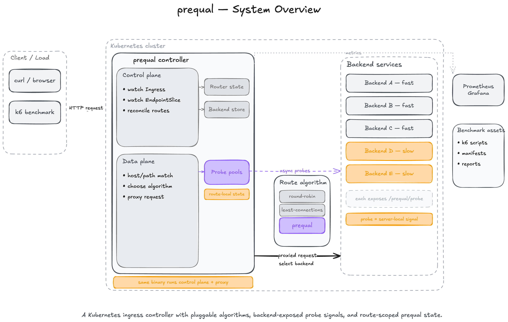
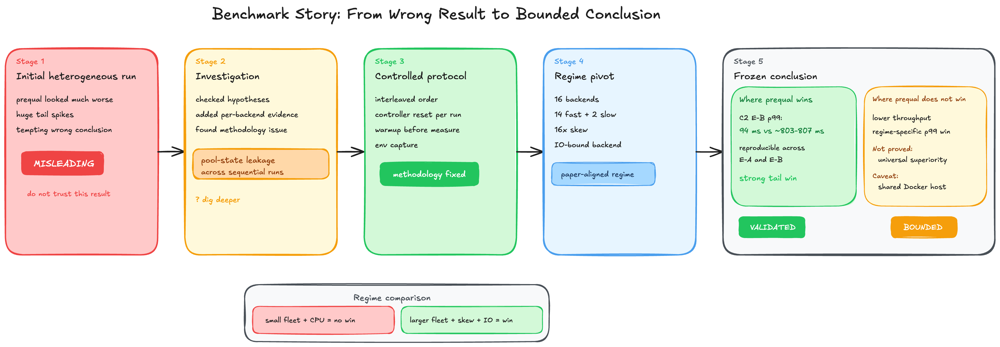

# prequal

An open Go implementation of the load-balancing idea Google says it uses across 20+ services, including YouTube's serving stack.

This repo reimplements **Prequal**, the algorithm from Wydrowski et al., [NSDI '24](https://www.usenix.org/system/files/nsdi24-wydrowski.pdf), as a Kubernetes ingress controller with a full benchmark harness, observability stack, and investigation trail.

> This is not Google's production Stubby-based code. It is an independent Go reimplementation of the algorithm and the ideas in the paper.

Tech deep dive: [sathwick.xyz/blog/prequal.html](https://sathwick.xyz/blog/prequal.html)


## Why this repo exists

Most load balancers try to spread work evenly.

Prequal starts from a different question:

which backend is least likely to make the next request wait?

That sounds small, but it changes the design:

- don't balance CPU just because CPU is easy to measure
- probe backends directly
- track requests-in-flight and latency together
- optimize for queueing and tail latency, not just average load

That is what made the paper interesting to me in the first place. Google's claim that this approach is used in production, especially in YouTube's serving stack, is what made it worth rebuilding carefully.

## What is in the repo

This project is more than just an algorithm demo. It includes:

- a Go Kubernetes ingress controller
- an in-process reverse proxy dataplane
- Prequal, round-robin, and least-connections selection paths
- route-local probe pools and async probing
- a Rust benchmark backend exposing `/work` and `/prequal/probe`
- `k6` load tests for open-loop, ramp, burst, overload, long-duration, and multi-route scenarios
- Prometheus metrics, Grafana dashboards, and pprof hooks
- frozen benchmark reports and investigation logs

The result is a repo you can read both as:

- a load-balancer implementation
- a case study in turning a systems paper into testable software



## The short version

In the paper-aligned regime, this implementation wins hard on the tail.

In the small-fleet CPU-bound regime, it loses.

That is the honest conclusion, and it is a big reason the repo is worth reading.

### Where it wins

On the repo's final paper-aligned benchmark shape:

- `16` backends
- `14` fast + `2` slow replicas
- `16x` service-time skew
- I/O-bound backend mode

Prequal cuts `p99` latency by:

- `8.6x` in `C2` heterogeneous open-loop on `E-B`
- `6.8x` in `C3` heterogeneous ramp on `E-B`

Headline numbers:

| scenario | algorithm | p99 ms | p99.9 ms |
|---|---|---:|---:|
| `C2` open-loop | **prequal** | **94.20** | **272.38** |
| `C2` open-loop | round-robin | 807.32 | 887.90 |
| `C2` open-loop | least-connections | 802.84 | 1006.78 |
| `C3` ramp | **prequal** | **123.39** | **824.08** |
| `C3` ramp | round-robin | 831.58 | 1250.41 |
| `C3` ramp | least-connections | 867.93 | 1596.51 |

What is happening mechanically:

- `prequal` pushes traffic almost entirely onto the fast replicas
- round-robin keeps sending a fixed share to the slow pair
- least-connections improves earlier percentiles, but still reacts too slowly to save the tail

Per-backend selection data in the frozen campaigns shows the two slow replicas getting driven down to under `0.1` selections/sec each.

### Where it does not win

On the small CPU-bound setup:

- `4` backends
- SHA256-bound workload
- closed-loop `30` VUs

Prequal is about `25%` slower than round-robin on throughput and has a worse tail.

| algorithm | throughput rps | p99 ms |
|---|---:|---:|
| prequal | 4162 | 29.86 |
| round-robin | 5366 | 20.22 |
| least-connections | 4965 | 23.48 |

That negative result stays in the repo on purpose. This is not a "Prequal always wins" repo. It is a repo about when this design does and does not pay off.



## Why the benchmark trail matters

The most interesting thing in this repo is not only the final result.

It is the path to the final result.

An early benchmark made Prequal look dramatically worse than the baselines. That turned out not to be an algorithm failure, but a methodology failure:

- sequential algorithm ordering
- state leakage between runs
- missing reset/warmup discipline

Once the protocol was fixed, the "Prequal is 10x worse" story disappeared without changing the algorithm code.

That whole trail is preserved here:

- wrong run
- investigation
- protocol fix
- negative small-fleet result
- regime pivot
- final bounded claim

If you care about benchmarking, that part is as valuable as the code.

## How the implementation works

At runtime this project is one Go binary with two jobs:

- a Kubernetes controller
- an HTTP reverse proxy

The controller watches `Ingress` and `EndpointSlice`, builds an in-memory router, and maintains route-local endpoint state.

The proxy:

1. matches host/path
2. resolves candidate backends
3. triggers async probes
4. selects a backend using the configured algorithm
5. forwards the request
6. records local observations and metrics

The main implementation pieces are:

```text
controller/      Kubernetes reconciliation and route state
server/          Reverse proxy and request-path selection
loadbalancer/    Prequal, least-connections, round-robin, probe logic, RIF, latency, pools
backend/         Rust benchmark backend exposing /work and /prequal/probe
observability/   Prometheus metrics
tree/            Host/path trie for ingress routing
benchmark/       Manifests, scripts, dashboards, reports, investigations, raw results
```

### The core Prequal rule

Prequal in this repo uses the same two signals the paper is built around:

- requests-in-flight (`RIF`)
- latency

Selection is hot-cold lexicographic:

1. split the probe pool using an `RIF` quantile threshold
2. among the cold entries, pick the lowest-latency backend
3. if all entries are hot, pick the backend with the lowest `RIF`

That logic lives in [`loadbalancer/pool/pool.go`](loadbalancer/pool/pool.go).

### Async probing

The request path does not synchronously block on probes.

Instead:

- incoming requests enqueue route probe work
- background workers call `/prequal/probe`
- probe responses populate a bounded route-local pool
- the proxy selects from that sampled state

This keeps probing off the critical path while still giving the load balancer fresh backend data.

### Route-local state

One of the most important implementation choices is that balancing state is route-local.

Each route gets its own probe pool. That means:

- no cross-route contamination
- cleaner reasoning
- more meaningful multi-route tests

## Repo status

This is a serious implementation, but it is still a testbed project, not a production ingress.

What is already solid:

- the core algorithm path
- the route/controller/proxy split
- benchmark automation
- observability
- unit tests across the main packages
- frozen benchmark evidence and investigation notes

What is intentionally not over-claimed:

- this is not Google's production code
- this is not cross-infrastructure proof
- this is not a universal replacement for simpler algorithms

The current campaign is strongest around:

- `C1` small CPU-bound baseline
- `C2` heterogeneous open-loop
- `C3` heterogeneous ramp
- both `E-A` and `E-B` cluster topologies

The main caveat remains:

> Both benchmark environments share the same Docker host. The evidence is strong testbed evidence, not final cross-infrastructure proof.

## Quickstart

### Prerequisites

- Go `1.22+`
- Docker
- `kubectl`
- `kind`
- `k6`

### Run tests

```bash
go test ./...
cd backend && cargo test
```

### Build locally

```bash
make build
```

### Run the benchmark stack

```bash
# 1. Create the E-B cluster
kind create cluster --name kind --config benchmark/kind-config-e-b.yaml

# 2. Build and load images
make docker-build
make kind-load KIND_CLUSTER_NAME=kind
cd backend && docker build -t prequal-backend:latest . && cd -
kind load docker-image prequal-backend:latest --name kind

# 3. Deploy controller + workload
kubectl apply -f benchmark/manifests/controller-benchmark.yaml
kubectl apply -f benchmark/manifests/workload-heterogeneous.yaml

# 4. Start observability
benchmark/scripts/port_forward_scrape.sh &
cd benchmark/observability && docker compose up -d && cd -

# 5. Run the controlled C2 campaign
REPS=5 ALGORITHMS="prequal round-robin least-connections" \
SCENARIO=heterogeneous-open-loop-eb \
K6_SCRIPT=benchmark/k6/open_loop.js \
WORKLOAD_MANIFEST=benchmark/manifests/workload-heterogeneous.yaml \
RATE=500 DURATION=300s WORK_ITERATIONS=1000 \
TARGET_URL=http://127.0.0.1:31080/work HOST_HEADER=bench.local \
ENVIRONMENT=E-B-kind-multinode \
INGRESS_NAME=bench-heterogeneous NAMESPACE=prequal-benchmark \
RESET_CONTROLLER=1 POOL_RESET_WARMUP_SEC=15 \
benchmark/scripts/run_interleaved_campaign.sh
```

When the run finishes:

- raw results land under [`benchmark/results/`](benchmark/results)
- aggregated summaries land under [`benchmark/results/aggregated/`](benchmark/results/aggregated)
- dashboards can be rendered with [`benchmark/scripts/render_dashboards.sh`](benchmark/scripts/render_dashboards.sh)

## What to read next

If you want the shortest route through the repo:

### Start here

- Paper: [*Load is not what you should balance: Introducing Prequal*](https://www.usenix.org/system/files/nsdi24-wydrowski.pdf)
- Frozen benchmark report: [`benchmark/REPORT.md`](benchmark/REPORT.md)
- Public technical blog: [sathwick.xyz/blog/prequal.html](https://sathwick.xyz/blog/prequal.html)

### Then read these

- Tail-spike investigation: [`benchmark/investigations/2026-04-19-c2-tail-spike.md`](benchmark/investigations/2026-04-19-c2-tail-spike.md)
- Regime pivot: [`benchmark/investigations/2026-04-20-regime-pivot.md`](benchmark/investigations/2026-04-20-regime-pivot.md)
- Overhead profiling: [`benchmark/investigations/2026-04-20-prequal-overhead-profiling.md`](benchmark/investigations/2026-04-20-prequal-overhead-profiling.md)

### Then inspect code

- [`main.go`](main.go)
- [`controller/controller.go`](controller/controller.go)
- [`controller/router.go`](controller/router.go)
- [`server/server.go`](server/server.go)
- [`loadbalancer/prober.go`](loadbalancer/prober.go)
- [`loadbalancer/pool/pool.go`](loadbalancer/pool/pool.go)
- [`backend/src/main.rs`](backend/src/main.rs)

## Why someone might try this repo

You should look at this repo if you want to:

- study a Go implementation of a Google/YouTube-proven load-balancing idea
- understand how to turn a systems paper into runnable software
- see a custom Kubernetes ingress controller that is small enough to read
- learn how to benchmark load-balancing behavior without hand-wavy conclusions
- reuse parts of the benchmark harness for your own infra experiments

## What would strengthen it further

If you pick this up, the next useful steps are:

- reproduce the decisive campaigns on independent cloud or bare-metal infra
- run the remaining scenarios under the controlled protocol
- sweep more paper-aligned probe parameters
- add small-fleet fallback behavior
- make probe sampling more faithful to the paper's without-replacement model

## License

[LICENSE](LICENSE)
