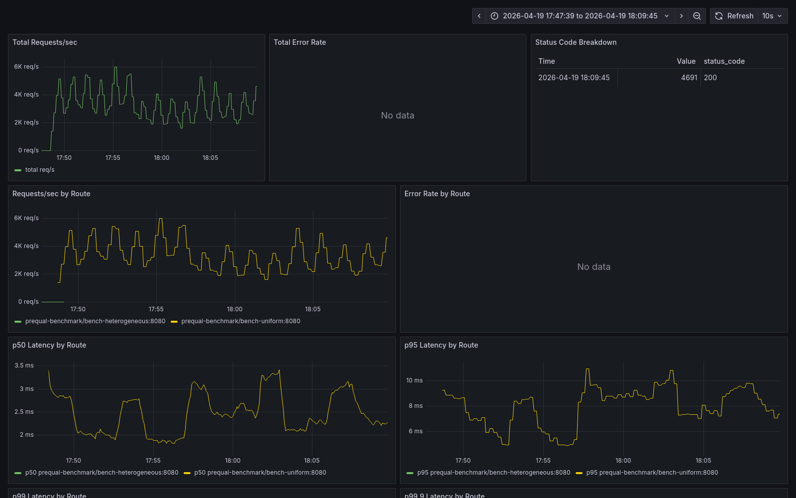
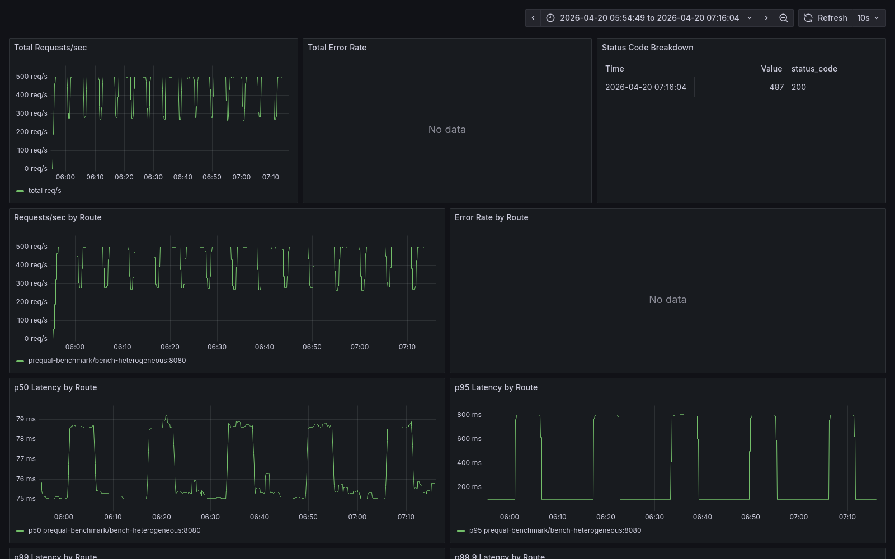
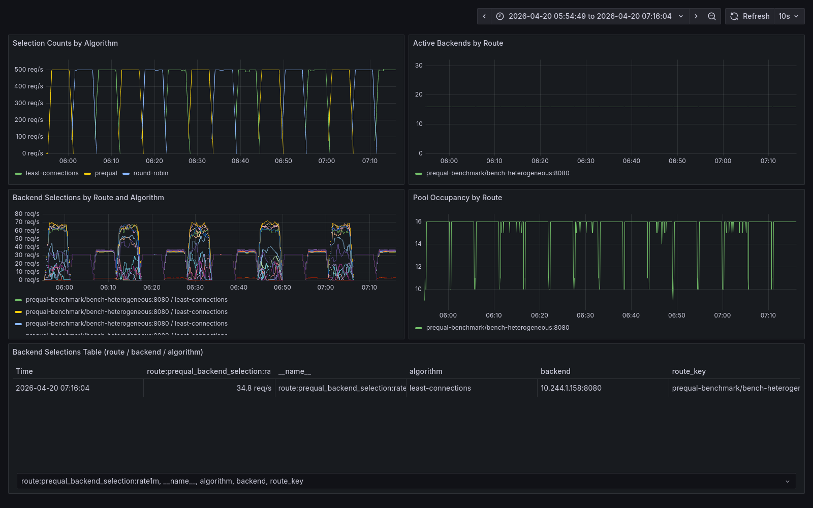

# Building `prequal`: a Kubernetes ingress controller, a failed benchmark, and a regime-specific `10x` tail-latency win

This is the long-form narrative behind the repo. The [README](README.md) gives the headline numbers and a reproduce-it path. The [canonical technical conclusion](benchmark/REPORT.md) states the frozen claim with bounded language and caveats. This post is what sits between those two: how the system got built, why the first benchmark result was wrong, what it took to get a trustworthy one, and what I actually learned.

If you want the original research first, the paper is [Wydrowski et al., NSDI '24 — Load is not what you should balance: Introducing Prequal](https://www.usenix.org/system/files/nsdi24-wydrowski.pdf).

## Why build this at all

I wanted to see whether the Prequal paper's central claim would reproduce inside a Kubernetes ingress controller I wrote myself. Most ingress controllers ship with `round-robin` or `least-connections`. Both are reasonable defaults, and both are blind to a specific class of failure mode: a backend can be technically healthy but materially slower than its peers, a backend can be locally congested in ways that CPU balancing doesn't capture, and when that happens the symptom shows up in the tail rather than the median.

The paper's idea is that in the right regime, active probes combined with requests-in-flight and measured latency from each backend can do better than blind distribution. A request-path proxy looks at recently probed backends, applies hot-cold lexicographic (HCL) selection among them, and routes accordingly. The paper demonstrates large tail-latency wins on Google-scale heterogeneous workloads.

The interesting question for me was never "can I implement the algorithm." It was more like: does the win survive being reimplemented from scratch in a different language, in a different deployment shape, on a much smaller cluster than the paper's? If yes, under what conditions? If not, why not?

## What the system actually looks like

The controller is one Go binary that does two jobs.

**Control plane.** It watches Kubernetes `Ingress` and `EndpointSlice` objects and materialises them into an in-memory router plus a backend IP store. Route matching is a host-and-path trie. One important correctness property is that route replacement is atomic from the proxy's perspective, so reconciliation under churn never exposes half-updated routing state. An earlier version of this code had transient gaps during updates; fixing that was a prerequisite for the benchmark campaign to mean anything.

**Data plane.** The proxy receives incoming HTTP requests, matches them against the router, picks a backend via the policy annotated on the route (`round-robin`, `least-connections`, or `prequal`), and forwards the request through `httputil.ReverseProxy`. For the first two policies, selection is straightforward. For `prequal`, the route keeps its own probe pool populated by asynchronous probes to backends, and selection is an HCL pass over that pool.

The algorithm's subsystems live under `loadbalancer/`:

- `prober.go` — an async prober that fires probes to random backends through a bounded worker pool, consumes a JSON response from `/prequal/probe` on each backend, and pushes results into the appropriate route's pool.
- `pool/pool.go` — the pool itself, with bounded size, age-based eviction, reuse-limit bookkeeping, and the `Select` call that implements HCL over live entries.
- `pool/pools.go` — the route-scoped map wrapper that keeps pools isolated so probes for route A never contaminate selections on route B.
- `latency.go` / `rif_tracker.go` — in-controller tracking of latency and requests-in-flight as a fallback signal for when the probe pool is starved.

The backend that serves `/prequal/probe` is a small Rust server in `backend/`. It reports three fields: current RIF, a local-median latency estimate from a RIF-conditioned bucket, and a server-side timestamp. The timestamp lets the controller reject stale probe responses.

A handful of implementation decisions mattered more than they looked at first.

**Route-scoped probe state.** One of the biggest correctness fixes during development was moving probe pools from a global structure into per-route instances. With a global pool, probe observations leaked between routes: route `B` requests could pick a backend that had only been observed under route `A`'s load. That was fixed well before any benchmark claim.

**Bounded probing.** The prober uses a fixed-size worker pool, a fixed-size trigger queue, a configurable `ProbesPerQuery` rate, and a periodic pool maintenance ticker. Without any of those bounds, the act of measuring the system becomes the thing that dominates the system. On a small kind cluster that's not a theoretical concern; it really happens if the knobs are unbounded.

**Metrics that say what the algorithm is doing, not just whether it's working.** `observability/metrics.go` exports per-backend selection rate, per-reason probe failure counts, probe queue depth, pool occupancy per route, and an explicit `random_fallback_rate` counter that goes up when the pool is empty and the proxy falls back to random selection. Those metrics turned out to be decisive for the debugging that followed.

## The first benchmark result was catastrophic (in the wrong direction)

The first real benchmark run was `Campaign 2 (heterogeneous open-loop)`: 4 backends (3 fast, 1 slow at `WORK_MULTIPLIER=4`), constant-arrival-rate 500 rps for 5 minutes, 3 reps per algorithm, run sequentially — all three `prequal` reps first, then all three round-robin, then all three least-connections.

The headline numbers made me stop whatever I was doing next.

| algorithm | p95 ms | p99 ms | p99.9 ms |
|-----------|-------:|-------:|---------:|
| prequal | 126 | **854** | **1822** |
| round-robin | 58 | 284 | 1802 |
| least-connections | 34 | 165 | 562 |

`prequal` wasn't just failing to win, it was losing by an order of magnitude on `p99`. Under the same throughput, with zero errors, with medians essentially tied, somewhere the algorithm was making occasional catastrophic selections that dominated the tail.

This is the point at which a short investigation could have concluded "the implementation is wrong" and started a hunt inside the HCL selection code. That's the direction I initially wanted to go. What held me back was that the algorithm's per-run variance was too high — one `prequal` rep had `p95` of 17 ms (fine), another had 196 ms (bad). An algorithm bug shouldn't produce that much swing between identical runs.

## The hypothesis tree

Rather than jumping to a code fix I wrote down every competing explanation and what evidence would distinguish between them. The full list lives in [`benchmark/investigations/2026-04-19-c2-tail-spike.md`](benchmark/investigations/2026-04-19-c2-tail-spike.md). The short version:

- **H1: `QRIF` is too lax.** With 4 backends and `QRIF=0.75`, 3 of 4 pool entries qualify as "cold," so HCL degenerates into picking the lowest-latency entry unconditionally. If that happens to be the slow backend (because it looks briefly idle before its queue fills), prequal keeps sending to it. Tuning problem.
- **H2: The backend's RIF-bucketed `latency_median_ms` hides the slow replica.** The Rust backend reports the median from whichever RIF bucket corresponds to its current in-flight count. At low RIF the slow backend reports low latency, because it hasn't accumulated queue depth yet. By the time RIF rises, the controller has already committed the request. Algorithm-fidelity problem.
- **H3: Pool reuse (`PoolReuseLimit=3`) amplifies stale observations.** A single probe reading can be reused for 3 selections over a 2-second window. If that reading was wrong (H2), the error compounds.
- **H4: Under-sampling relative to arrival rate.** `ProbesPerQuery=1.0` might not be enough to keep fast-backend latency observations fresh at 500 rps.
- **H5: Sequential algorithm ordering is leaking pool state between runs.** Each run's pool inherits state from the previous run of the same algorithm, and prequal-to-prequal pool warmth differs from round-robin-to-round-robin. Methodology problem, not algorithm problem.
- **H6: Open-loop at 500 rps hits a weird resonance.** The least likely but not ruled out.
- **H7: Random-fallback thrash.** If the pool empties and the controller falls back to random, prequal silently degenerates. Should show up as `random_fallback_rate > 0` but we weren't capturing that per-run.

I needed data to distinguish these. In particular I couldn't tell H5 from H2 without running an interleaved pass; I couldn't tell H7 from anything without capturing `random_fallback_rate`.

## The methodology fix that made everything change

I patched `run_campaign.sh` and its collector to capture `controller_env`, `backend_env`, per-backend selection rate, and random-fallback rate in every run. I also wrote `run_interleaved_campaign.sh`, which does two things the old script didn't:

1. Algorithm order is interleaved rather than sequential (prequal, round-robin, least-connections, prequal, round-robin, ...).
2. Before every single run, `kubectl rollout restart deploy/prequal-controller` is issued and the script waits 15 seconds for pools to re-populate from a cold start.

Then I reran `C2` on the same 4-backend heterogeneous workload, same script, same rate, same duration, just with 5 reps and the new protocol.

The result:

| algorithm | p95 ms | p99 ms | p99.9 ms |
|-----------|-------:|-------:|---------:|
| prequal | 3.27 | 15.22 | 54.40 |
| round-robin | 3.25 | 14.40 | 49.88 |
| least-connections | 3.37 | 15.30 | 59.19 |

A `39x` reduction on `p95`. A `56x` reduction on `p99`. No code change, no tuning change — only the protocol changed. The prior tail-spike was pool-state leakage between sequential runs, which interacted with prequal's reuse behavior in a way that gave prequal the worst of it. Once every run started cold, all three algorithms converged.

**This is the lesson I wish I'd internalised earlier:** benchmark methodology can be wrong in ways that look like algorithm failure. If I'd been less paranoid and gone straight to a code hunt in HCL, I would have spent days "fixing" a perfectly correct implementation.

## Stable but uninteresting: all three algorithms tie

The methodology fix resolved the disaster, but it also produced a different kind of problem. Once the noise went away, none of the three algorithms won. `prequal` wasn't losing anymore, but it wasn't winning either. The paper predicts a large tail-latency advantage under heterogeneous capacity, and I didn't see one.

Still, the numbers were internally consistent, per-backend selection showed `prequal` correctly avoiding the slow replica, and `random_fallback_rate` was zero. The algorithm was doing what it said it did; there just wasn't a gap for it to exploit.

The small-fleet CPU-bound `C1` regime (uniform workload, 4 backends running SHA256, closed-loop 30 VUs) even went the other way: `prequal` was 25% slower than `round-robin` on throughput and worse on `p99`. I kept staring at the profiles trying to find a hot path that would explain it.

The pprof data (`CPU`, mutex, block, heap, goroutines) all agreed: the controller was barely doing anything. Total controller CPU at 498 rps was `29.6%` of a single core. No user-code function cleared `1%` flat. Mutex contention was about `1.1 µs` per request. Heap was `3 MB`. There was no hot spot to optimize.

The profile matched the k6 numbers once I worked through the arithmetic. `C1` is closed-loop with 30 VUs, so throughput equals `30 / avg_latency`. `prequal`'s average was `7.15 ms`, giving about `4195 rps` (observed `4162`). Round-robin's average was `5.54 ms`, giving about `5415 rps` (observed `5366`). The gap is `1.6 ms` of latency per request, which at this scale is `~100x` what the controller itself can possibly account for. The cost had to be outside the controller.

That led me to the explanation that ended up in the final writeup: on CPU-bound backends, `prequal`'s probe traffic competes with user traffic for the same backend CPU budget. Each probe is cheap in the controller but costs backend CPU time. The aggregate effect is a diffuse `1.6 ms` per user request that no single function shows up as. The full profile analysis is in [`benchmark/investigations/2026-04-20-prequal-overhead-profiling.md`](benchmark/investigations/2026-04-20-prequal-overhead-profiling.md).

The prediction from that explanation was testable: if the backends stopped being CPU-bound, the probe traffic wouldn't compete for the same budget, the overhead should disappear, and whatever regime advantage `prequal` has should surface.

## The regime pivot

Three changes, all in the workload, none in the controller or algorithm:

1. **I/O-bound backend.** A new `IO_BOUND_MODE=1` env var in the Rust backend that replaces the SHA256 loop with `tokio::time::sleep(iterations × 50µs)`. Zero CPU per request, deterministic service time. `WORK_ITERATIONS=1000` becomes a 50 ms sleep.
2. **16 backends instead of 4.** Fourteen fast replicas with `WORK_MULTIPLIER=1.0`, two slow replicas with `WORK_MULTIPLIER=16.0`. The paper's scenarios have much larger fleets; four backends give HCL almost no sampling diversity to work with. Sixteen is still small but no longer trivial.
3. **Skew of 16x, not 4x.** Each slow-replica request now costs 16 fast-replica requests. Every mis-selection is much more expensive, so the algorithm's value (avoiding the slow pool) scales up.

The first post-pivot `C2` run produced this:

| algorithm | p95 ms | p99 ms | p99.9 ms |
|-----------|-------:|-------:|---------:|
| prequal | 59.48 | **80.60** | 127.49 |
| round-robin | 803.69 | 807.12 | 834.90 |
| least-connections | 62.85 | 802.46 | 808.82 |

**10x on `p99`.** Round-robin blindly sends `2/16 = 12.5%` of traffic into the slow replicas, and those requests queue to the full `~800 ms` service time, which pins round-robin's whole tail at that floor. Least-connections does better than round-robin on `p95` because RIF tracking eventually steers new traffic away from slow backends, but any request that arrived before RIF updated still pays the queue cost, which pins least-connections' `p99` at the same `~800 ms` floor. `prequal` never sends the request at all — per-backend selection data shows the two slow replicas receiving less than `0.1` selections per second each.

The dashboard is the clearest visual evidence. Fifteen alternating runs (five each of the three algorithms) under identical conditions. `p50` is the same flat line for all of them. Only the `p95` and `p99` panels separate, and they separate along exactly the algorithm phase boundaries.

The algorithm-behavior panel supports the mechanism, not just the outcome. During `prequal` windows the selection distribution across backends stays dense; during round-robin windows it stays uniform (including the slow replicas); during least-connections windows it skews modestly toward the fast replicas but never eliminates the slow ones.

`C3` (a rate ramp from 100 to 1500 rps over 370 seconds on the same topology) showed the same shape with smaller margins: `prequal` `p99` of `117 ms`, round-robin `834 ms`, least-connections `802 ms`. That's a `6.8x` win, less dramatic than `C2` but through a harder range of load conditions.

## Does it survive cluster-topology changes?

`E-A` is the environment I'd been running on: single-host `kind` with the controller colocated on a worker node. Controller shares CPU with some of the backends. The first `C2` and `C3` pivot results were both `E-A`.

`E-B` is a stronger cluster shape on the same Docker host. I added a toleration and `nodeSelector` to the controller manifest so it schedules exclusively on `kind-control-plane` (the tainted control-plane node, otherwise empty), and added `topologySpreadConstraints` to both `bench-fast` and `bench-slow` so the backend pods spread across `kind-worker` and `kind-worker2`. That separates the controller's CPU from backend CPU at the node level.

I reran `C2` and `C3` under `E-B`. `C2` `p99` went from `80.60 ms` to `94.20 ms` for `prequal` — a small degradation I attribute to the control-plane node being a noisier scheduling neighbor (`kube-apiserver`, `etcd`, `kube-scheduler` all compete for CPU there). Round-robin and least-connections numbers barely moved. The advantage ratio shrank from `10.0x` to `8.6x`, which is within the min-max range of either environment's own variance.

`C3` shifted even less: prequal `p99` from `117.34` to `123.39`, advantage ratio from `7.1x` to `6.8x`.

The advantage reproduces. Two cluster topologies isn't the same as two independent clusters, but it's not nothing.

## Why I believe the win

Four converging lines of evidence.

The selection mechanism behaves correctly. Per-backend selection rate shows `prequal` driving traffic to the two slow replicas down to effectively zero while fast-replica distribution stays nonzero everywhere. That rules out "prequal is winning by accident."

The random-fallback rate is zero on every decisive run. The pool never empties. Prequal is operating in HCL mode the whole time, not degenerating to some simpler policy that happens to be doing the work.

The result reproduces across two cluster topologies on the same host. `E-A` and `E-B` differ in whether the controller shares CPU with backends. Both produce ratios above the `2x` threshold I set for the decision rule.

The controller itself is cheap. The profiling investigation rules out hot CPU paths, mutex contention, heap pressure, and request-path blocking as explanations for the `C1` deficit. That means the cost the algorithm pays (when it pays one) is network-shaped, not implementation-shaped.

## What this repo can and can't claim

The strongest honest claim is narrow: *in this implementation, on this testbed, in the paper-aligned regime, `prequal` delivers a large reproducible `p99` win over round-robin and least-connections*. It's bounded by an equally important negative: *on small-fleet CPU-bound workloads, prequal does not win and in fact pays overhead*.

Both pieces matter, and the repo keeps both. The public summary matches the internal report matches the matrix matches the investigation logs.

The caveat that stays attached to everything above:

> Both benchmark environments share the same Docker host. The current result is strong testbed evidence, not final cross-infrastructure proof.

Other limits worth stating plainly: the backend is a simulator, not a real service; the positive regime is specific (14 fast plus 2 slow with 16× skew); the controller is not a finished production ingress; the evidence doesn't yet cover independent cloud or bare-metal reproduction. Any of those could meaningfully change the numbers.

## What I think I actually learned

Three things I would not have learned from just reading the paper.

**Route-local correctness has to come before any performance claim.** An earlier version of the controller shared probe state across routes, and that bug was invisible under single-route benchmarking. It would have invalidated the entire benchmark campaign if I hadn't fixed it before running serious loads. Per-route isolation wasn't a feature request, it was a correctness prerequisite.

**Benchmark methodology is an adversarial surface.** The 3-rep sequential pass that made prequal look catastrophically bad wasn't malicious, it was just sloppy. I ran the tests in the order I happened to run them, didn't reset state between runs, didn't capture environment knobs in run metadata, and couldn't tell whether the result was real or an artifact until I fixed all of those. The time spent building [`run_interleaved_campaign.sh`](benchmark/scripts/run_interleaved_campaign.sh) was more valuable than any single code change in the controller.

**Load-balancing policies are regime-sensitive, and the honest answer is conditional.** Prequal is not universally better than round-robin. In some regimes it's worse. The useful question is not "which algorithm wins" but "under what conditions does each algorithm win, and by how much." Framing the result that way led to a much more defensible public claim than I could have made while still trying to shoehorn a universal answer out of the data.

## What's next (or, reasons to treat this as a waypoint rather than a finished thing)

Three directions the work could usefully go, none of which I plan to do right now.

Reproduction on an independent cluster. Cloud or bare-metal, ideally one I don't own. The same-host caveat is the single largest constraint on how strongly this evidence can be cited. Lifting it would graduate the result from a testbed study to something closer to a real cross-infrastructure claim.

Campaigns `C4` through `C9` from the matrix: multi-route isolation, long-duration stability, overload, churn, fault injection, and an external NGINX baseline. The code and infrastructure for every one of these is already in the repo. None of them has been run under the controlled protocol.

The three overhead levers the profiling investigation identified: a `ProbesPerQuery` sweep in small-fleet CPU-bound regimes, batched probe dispatch, and small-fleet runtime gating (fall back to round-robin when `len(backends) <= N`). None of these would matter if prequal is only ever used as an opt-in policy. They would matter if it became a default.

## Read next

- [README](README.md) for the short version with headline screenshots
- [benchmark/REPORT.md](benchmark/REPORT.md) for the canonical frozen technical conclusion
- [benchmark/PUBLIC_WRITEUP.md](benchmark/PUBLIC_WRITEUP.md) for a shorter public summary
- [benchmark/benchmarking-matrix.md](benchmark/benchmarking-matrix.md) for the row-by-row frozen campaign record
- [benchmark/investigations/2026-04-19-c2-tail-spike.md](benchmark/investigations/2026-04-19-c2-tail-spike.md) for the methodology-failure debugging trail
- [benchmark/investigations/2026-04-20-regime-pivot.md](benchmark/investigations/2026-04-20-regime-pivot.md) for the pivot that produced the positive result
- [benchmark/investigations/2026-04-20-prequal-overhead-profiling.md](benchmark/investigations/2026-04-20-prequal-overhead-profiling.md) for the pprof analysis of the controller under load
