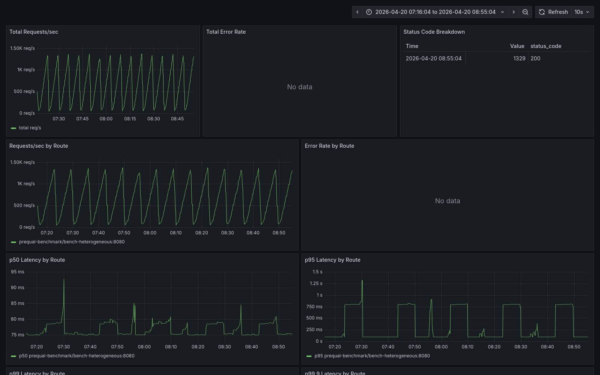

# Prequal Benchmark Report (frozen 2026-04-20)

This is the single document for the frozen Prequal benchmark campaign — technical conclusion, campaign matrix, paper divergences, and publication playbook all in one place. Raw evidence sits under `benchmark/results/`; the investigation logs at `benchmark/investigations/` walk how the campaign got here.

**Paper:** Wydrowski, Kleinberg, Rumble, Archer. *Load is not what you should balance: Introducing Prequal.* [NSDI '24](https://www.usenix.org/system/files/nsdi24-wydrowski.pdf).

**Why this matters.** Prequal is not just an academic algorithm on paper: Google reports deploying it across 20+ services, including YouTube's serving stack. That production provenance is the reason this repo exists.

**What this is.** A Go reimplementation of Prequal, packaged as a Kubernetes ingress controller. The repo reimplements the algorithm; it is not Google's Stubby-based production code.

---

## Contents

1. [Current claim](#1-current-claim)
2. [Headline numbers](#2-headline-numbers)
3. [Where Prequal does not win](#3-where-prequal-does-not-win)
4. [Methodology was part of the result](#4-methodology-was-part-of-the-result)
5. [Caveats](#5-caveats)
6. [What this testbed proves / does not prove](#6-what-this-testbed-proves--does-not-prove)
7. [Paper divergences](#7-paper-divergences)
8. [Campaign matrix](#8-campaign-matrix)
9. [Publication standards and claim levels](#9-publication-standards-and-claim-levels)
10. [Status and next steps](#10-status-and-next-steps)
11. [Evidence pointers](#11-evidence-pointers)

---

## 1. Current claim

Two statements we can support:

- **Claim 1 (supported).** In the paper-aligned regime — 16 backends, 16× capacity skew between fast and slow replicas, I/O-bound service times — our implementation of Prequal delivers a large and reproducible p99 tail-latency advantage over both `round-robin` and `least-connections`. The advantage reproduces across **two cluster topologies on the same host** (E-A single-host kind with controller colocated on a worker; E-B multi-node kind with controller isolated on the control-plane and backends topology-spread across workers). The decision-rule 2× threshold is cleared in both C2 (open-loop 500 rps) and C3 (rate ramp 100→1500 rps).

- **Claim 2 (supported, and deliberately symmetric).** In a **small-fleet CPU-bound regime** — 4 backends, SHA256-bound workload, 30-VU closed-loop — our implementation of Prequal does **not** win. It pays a ~25% throughput overhead and does not improve tail latency. This is an honest characterisation: the algorithm's benefits are regime-dependent, and we report both sides of that.

This is not a universal-superiority claim. It is a regime-specific engineering result.

---

## 2. Headline numbers

### C2 heterogeneous-open-loop (500 rps × 300 s, 5 reps interleaved, IO-bound, skew=16, 14 fast + 2 slow)

| algorithm          | E-A p99 ms | E-B p99 ms | E-A p99.9 ms | E-B p99.9 ms |
|--------------------|-----------:|-----------:|-------------:|-------------:|
| **prequal**        | **80.60**  | **94.20**  | 127.49       | 272.38       |
| round-robin        | 807.12     | 807.32     | 834.90       | 887.90       |
| least-connections  | 802.46     | 802.84     | 808.82       | 1006.78      |
| **prequal vs best baseline (p99)** | **10.0×** | **8.6×**  |              |              |


### C3 heterogeneous-ramp (100→1500 rps, 370 s, 5 reps interleaved)

| algorithm          | E-A p99 ms | E-B p99 ms | E-A p99.9 ms | E-B p99.9 ms |
|--------------------|-----------:|-----------:|-------------:|-------------:|
| **prequal**        | **117.34** | **123.39** | 808.59       | 824.08       |
| round-robin        | 833.56     | 831.58     | 1249.13      | 1250.41      |
| least-connections  | 802.25     | 867.93     | 815.34       | 1596.51      |
| **prequal vs best baseline (p99)** | **7.1×** | **6.8×**   |              |              |




Throughput is tied across all three algorithms in both campaigns (~500 rps C2, ~695 rps C3). p50 is identical (~53 ms, the fast service time). The entire advantage is in the tail, which is what the Prequal paper predicts.

### Per-backend selection, Prequal (E-B C2)

14 fast backends share ~96% of traffic; 2 slow backends receive **<0.1 sel/s each** (effectively blackholed). `prequal_selection_algorithm_total{algorithm="random_fallback"}` is **0** on every run — the pool never starves.

### Why the win is real

This is not just a dashboard artifact. The supporting evidence chain is consistent:

- per-backend selection shows Prequal effectively blackholing the two slow replicas
- `random_fallback_rate = 0` on the decisive runs
- throughput is effectively tied across all three algorithms
- p50 stays at the fast service time for all three algorithms

The difference is not "Prequal is doing more work overall." The difference is that it is avoiding the slow replicas, and the gain shows up where it should: the tail.

---

## 3. Where Prequal does not win

In `C1` — small-fleet, CPU-bound, 4 backends, SHA256 workload, 30 VUs closed-loop — Prequal does **not** win:

| algorithm | throughput rps | p99 ms |
|-----------|---------------:|-------:|
| prequal | 4162 | 29.86 |
| round-robin | 5366 | 20.22 |
| least-connections | 4965 | 23.48 |

That is roughly a **25% throughput deficit** versus round-robin, with worse tail latency.


This matters because it keeps the conclusion honest: Prequal is not the right default for every regime. On small fleets with CPU-bound backends, the extra probing work adds cost without enough diversity or skew to pay it back. The overhead profile is in [`investigations/2026-04-20-prequal-overhead-profiling.md`](investigations/2026-04-20-prequal-overhead-profiling.md).

---

## 4. Methodology was part of the result

One of the most important findings was methodological, not algorithmic.

An earlier uncontrolled heterogeneous pass made Prequal look catastrophically worse — 10× worse than both baselines, in the opposite direction of the paper's claim. That turned out to be a testing error caused by sequential run ordering and pool-state leakage. Once the protocol was fixed to use:

- interleaved run order
- controller reset before every run
- 15 s warmup before measurement
- explicit environment capture

the uncontrolled negative result disappeared. Under the controlled protocol, the algorithm either tied or won depending on the regime. The seven competing hypotheses are walked in [`investigations/2026-04-19-c2-tail-spike.md`](investigations/2026-04-19-c2-tail-spike.md); the protocol fix produced a **56× p99 reduction** with zero algorithm code changed. The controlled protocol is in [`scripts/run_interleaved_campaign.sh`](scripts/run_interleaved_campaign.sh). Anyone trying to reproduce this needs that protocol.

---

## 5. Caveats

These are not footnotes — they are part of the claim.

- **Both environments share the same Docker host.** E-A and E-B differ in cluster topology (controller placement, pod spread) but run on the same Docker Desktop VM, same kernel, same hardware. This is **strong testbed evidence, not final cross-infrastructure proof**. A stronger public claim still wants an independent cloud or bare-metal cluster.
- **The backend is a simulator.** `IO_BOUND_MODE=1` replaces the SHA256 loop with `tokio::time::sleep(iterations × 50 µs)`. Real service time has variance, retries, backpressure, and connection-pool effects. Our numbers are cleaner than real-world numbers will be.
- **The regime is specific.** 14 fast + 2 slow at 16× skew is the paper's regime, which the algorithm was designed for. On uniform-capacity workloads (`workload-uniform.yaml`) all three algorithms converge on the fast service time; no separation is expected and none observed. On small-fleet CPU-bound workloads (C1), Prequal loses by ~25% throughput (see §3). The regime matters.
- **"Controller isolated on control-plane" is better E-B than E-A, but still not independent.** E-B's control-plane shares the Docker VM with the workers. The kube-apiserver, etcd, and kube-scheduler are neighbours of the controller on that node. This shows up as a slightly elevated Prequal p99.9 on E-B (272 ms vs 127 ms on C2) — not enough to affect the verdict, but visible.
- **Methodology is non-optional.** See §4. Pool-state leakage between sequential runs is a real failure mode; any reproduction attempt needs the controlled protocol (`benchmark/scripts/run_interleaved_campaign.sh` with `RESET_CONTROLLER=1 POOL_RESET_WARMUP_SEC=15`).

---

## 6. What this testbed proves / does not prove

### Proves

- Prequal's HCL selection correctly identifies and avoids slow replicas across 16 backends, in both cluster topologies, under steady-state (C2) and past-saturation ramp (C3). Per-backend selection rates confirm the algorithm's core behavior.
- The algorithm's benefit is reproducible across two cluster topologies on the same host, with consistent baseline behavior. The "two environments minimum" bar is met on this testbed.
- The controller is cheap. CPU profiling under Prequal load shows no user-code function exceeding 1% flat; mutex contention is ~1.1 µs per request. The cost that does exist (~25% on C1) localises to network / probe competition, not to hot paths in the controller itself.

### Does NOT prove

- That results generalise to independent hosts (see caveats).
- That results generalise to real-service backends with variance, backpressure, cold caches, or downstream-RPC failure modes.
- That results generalise to fleet sizes meaningfully different from 16 (smaller or much larger).
- That the algorithm is the right default for every regime. On small-fleet CPU-bound workloads it is not.

---

## 7. Paper divergences

The implementation is faithful on the core algorithm (HCL selection, two-signal probing, bounded pool, alternating eviction) but diverges in several parameters and some mechanics. The paper's implementation lives inside Google's Stubby RPC framework; this repo is a Go Kubernetes ingress controller. They share an algorithm, not an environment.

### 7.1 At-a-glance comparison

| Item | Paper | Repo | Verdict |
|---|---|---|---|
| HCL selection rule | cold → min latency; all-hot → min RIF | `pool.Select` same | **faithful** |
| Hot/cold split at RIF quantile | yes | yes | **faithful** |
| Probe pool size `m` | 16 ("16 suffices") | `PoolMaxSize=16` | **faithful** |
| Probe age cap | 1 s | `PoolMaxAge=1s` | **faithful** |
| Random fallback when pool < 2 | "if the pool is empty … uniformly random" | `pool.go` fallback path | **faithful** |
| Async probing off critical path | yes | yes | **faithful** |
| RIF-conditioned latency median on backend | "latency values at (or near) the current RIF" | 5-bucket scheme in Rust backend | **faithful** |
| Eviction policy (oldest vs worst-load, alternating) | yes | `RemoveWorst` alternating | **faithful** |
| Two signals only (RIF + latency) | yes | yes | **faithful** |
| `Q_RIF` default | `2^(-0.25) ≈ 0.84` | `0.75` | minor, in recommended `[0.6, 0.9]` band |
| Probes per query | 3 (testbed), 5 (YouTube) | `1.0` | **major, likely consequential** |
| `b_reuse` reuse limit | derived per Eq. 1 | hardcoded `3` | major by design, minor in practice for this testbed |
| `r_remove` removal rate | per-query, 1/query | on a 100 ms maintenance tick | medium, behavioural proxy |
| Probe-target sampling | "uniformly at random without replacement" | `rand.Intn(...)` single-pick, with replacement | **latent bug** if probes/query ≥ 2 |
| Workload shape | CPU-bound hash, variable iterations, antagonist-driven overload | IO-bound `tokio::sleep`, static capacity skew | **major, affects which regime wins** |
| Sync mode | present, used in YouTube | not implemented | deliberate, out-of-scope |

### 7.2 `Q_RIF = 0.75` instead of the paper's `~0.84`

**Paper (§5 baseline):** *"Unless otherwise specified, we set `Q_RIF = 2^(−0.25) ≈ 0.84`."* §5.2 recommends `Q_RIF ∈ [0.6, 0.9]`.

**Repo:** `loadbalancer/config.go` → `QRIF: 0.75`.

**Why.** `0.75` is a round number in the middle of the paper's recommended band. No deliberate empirical reason to prefer it over `0.84`; it was set once and never swept.

**Consequence.** Expected to be small. The paper's Figure 9 shows latency quantiles move smoothly across `Q_RIF ∈ [0.35, 0.99]`; `0.75` and `0.84` fall in the flat part of that curve.

**Fix.** Single env var: `PREQUAL_QRIF=0.84`.

### 7.3 `ProbesPerQuery = 1.0` instead of the paper's `3` (or YouTube's `5`)

**Paper (§5 baseline):** *"We use 3 probes per query as our baseline probe rate to stay safely away from probe rates low enough to impact performance."* §3 reports YouTube uses *5 probes per query*.

**Paper (§5.3) explicitly warns against going lower:** *"At probing rates of `1/√2 ×` and `1/2 ×` [the query rate], the tail RIF distributions jump visibly, and this change is echoed by both latency quantiles. Anecdotally, we have observed this phenomenon across many similar experiments, always around 1 probe per query."*

**Repo:** `loadbalancer/config.go` → `ProbesPerQuery: 1.0`, right at the edge the paper calls the unsafe boundary.

**Why.** The original goal was to keep probe overhead bounded on a small kind cluster. `ProbesPerQuery=1.0` was the minimum that could still keep the pool populated at 500 rps.

**Consequence.** Strong candidate for the C1 25% throughput loss. On IO-bound C2/C3 the margin is so large (10×) that this parameter being slightly off doesn't threaten the claim — but it is still a departure from the paper's default.

**Fix.** Bump to `3` for fleets ≥ 8 and sweep `{1, 2, 3, 5}` on C2/C3.

### 7.4 `b_reuse = 3` hardcoded instead of derived from Equation 1

**Paper (§4, Eq. 1):**

```
b_reuse = max { 1,  (1 + δ) / ((1 − m/n) · r_probe − r_remove) }
```

**Paper default values:** `m=16, n=100, r_probe=3, r_remove=1, δ=1` → `b_reuse = max{1, 2/1.52} ≈ 1.32`, stochastically rounded.

**Repo:** `loadbalancer/config.go` → `PoolReuseLimit: 3`, decremented on every successful `Select`.

**Why.** The paper's formula assumes `n >> m`. On C2/C3, `n = 16 = m`, which makes `1 − m/n = 0` and the denominator degenerate. `3` is a fixed choice in the plausible range for the testbed scale.

**Consequence.** On 16-backend workloads, likely harmless. On a paper-scale deployment (`n=100, m=16`) the hardcoded `3` would be close to but not matching the paper's derived `≈1.3`, probably producing slightly more stale-probe effects.

**Fix.** Compute `b_reuse` from `(m, n, r_probe, r_remove, δ)` once `n > m`. Keep the constant as fallback when `n ≤ m`.

### 7.5 `r_remove` is maintenance-tick driven, not per-query

**Paper (§4):** *"We define a `r_remove` parameter, and delete that many probes from the pool with each query. … We alternate our removals between worst and oldest."*

**Repo:** Per-query removal happens implicitly through `UsesLeft` decrement on `Select`. Explicit "worst/oldest" removal happens only on the 100 ms maintenance tick in `pools.Run`, not on every request.

At 500 rps, this is ~500 `UsesLeft`-driven removals/s + ~10 `RemoveWorst` calls/s, vs the paper's 500 per-query removals/s.

**Why.** Per-request mutex work was the original concern. The maintenance-tick design moves that work off the hot path.

**Consequence.** The two churn mechanisms are not exactly equivalent. The paper's design biases the pool toward fresh and cold; the repo removes the most-reused probe most of the time. In steady state both converge on a similar pool composition; under transients they can diverge. Overhead profiling confirmed the controller side is cheap regardless.

**Fix.** Add a per-`Select` call to `RemoveWorst` gated by a random-rounded `r_remove`, alternating oldest/worst.

### 7.6 Probe targets are sampled with replacement, single-pick

**Paper (§4):** *"Probe destinations are sampled uniformly at random without replacement from the set of available replicas."*

**Repo:** `loadbalancer/prober.go` → `ProbeRandom` does one `rand.Intn(len(backends))` per enqueued job; the same backend can appear in multiple consecutive probes.

**Why.** At `ProbesPerQuery = 1.0` this is moot.

**Consequence.** **Latent bug.** The moment `ProbesPerQuery ≥ 2`, the sampling guarantees break. The repo would probe the same backend twice in the same query with positive probability.

**Fix.** `TriggerProbes` should draw `n` distinct backends (reservoir sample or `rand.Shuffle` + take-first-n). Pairs with divergence 7.3.

### 7.7 Workload regime: capacity skew instead of antagonist-induced overload

**Paper (§5):** 100 client/server replicas each, 10% CPU allocation per server, CPU-intensive hash workload, wins come from time-varying antagonist overflow.

**Repo:** 16 backends (14 fast + 2 slow with `WORK_MULTIPLIER=16.0`), IO-bound mode, no antagonist load. Service-time skew is static.

**Why.** Kubernetes-in-Docker cannot realistically simulate the paper's scenario. Isolating 100 replicas at 10% CPU each with variable antagonist overflow is not a thing you can do on a laptop. Static capacity skew is the closest local proxy.

**Consequence.** The repo's headline 10× result does not reproduce the paper's specific experiment. It produces a shape-of-result-compatible experiment in a different regime. The repo cannot claim "we reproduced the paper's result"; it can claim "in a regime that stresses the same mechanism Prequal was designed to fix, the algorithm wins as the paper's model predicts."

The C1 negative result (25% Prequal loss on 4-backend CPU-bound closed-loop) is consistent with the paper: at that scale there is no antagonist-induced overload, probe overhead is real, HCL has no sample diversity.

**Fix.** An overload variant of C2 (paper §5.1-style) would get closer to the paper's actual experiment. Infrastructure already exists (`benchmark/k6/overload.js`); listed as C6 in the matrix and is unexecuted.

### 7.8 Sync mode is not implemented

**Paper (§4):** sync mode is used for part of YouTube.

**Repo:** Async only.

**Why.** Sync mode's canonical use case (cache-aware routing at YouTube Homepage) requires a richer probe-response contract that doesn't fit a generic K8s ingress.

**Consequence.** None for the claim as written. Claim scope excludes sync-mode use cases.

### 7.9 Things the repo does that the paper didn't have to

The ingress context requires mechanisms the paper's RPC-framework context did not.

- **Route-scoped probe pools.** `loadbalancer/pool/pools.go` keeps independent pools per route key. Correctness prerequisite for any multi-route deployment.
- **Staleness-gated probe timestamps.** Every probe response carries a backend-side timestamp; the controller rejects probes where `time.Since(ts) > MaxProbeAge`. More robust against clock skew than pure reuse bookkeeping.
- **`random_fallback_rate` as an explicit metric.** `observability/metrics.go` exports `prequal_selection_algorithm_total{algorithm="random_fallback"}`. Without this metric, pool starvation silently degrades HCL into random selection and you won't notice from p99 alone.

### 7.10 What to close first

1. **7.3** — `ProbesPerQuery: 1.0 → 3`. No code change.
2. **7.6** — switch `Prober` to without-replacement sampling *before* bumping probe rate.
3. **7.2** — `QRIF: 0.75 → 0.84`. Trivial.
4. **7.7 (partial)** — run C6 (overload variant) on E-B under the controlled protocol.
5. **7.5** — fold `r_remove` into the per-request path.
6. **7.4** — derive `b_reuse` from Eq. 1 when `n > m`.

Divergences 7.7 (fully) and 7.8 are out-of-scope for the current testbed.

---

## 8. Campaign matrix

Primary evidence is the **E-B C2 + C3** runs under the pivoted regime. Previous E-A first-pass data is preserved as cross-environment background.

Environments: **E-A** (local kind single-node), **E-B** (multi-node cluster), **E-C** (independent second environment — not yet exercised).

Rate model shorthand: `closed-loop` / `open-N` (constant N rps) / `ramp` / `burst` / `soak` / `overload`.

Algorithms per row: `prequal`, `round-robin`, `least-connections` unless restricted.

### 8.1 Campaign 1 — Baseline correctness and smoke

Closed-loop 30 VUs, 60 s steady-state, `WORK_ITERATIONS=1000`, uniform workload (4 backend replicas, `WORK_MULTIPLIER=1.0`). E-A, 5 reps interleaved, controller reset + 15 s warmup before every run.

| algorithm         | reps | rps               | avg ms          | p50 ms          | p95 ms               | p99 ms                 | p99.9 ms                  | rf/s |
|-------------------|-----:|-------------------|-----------------|-----------------|----------------------|------------------------|---------------------------|-----:|
| prequal           | 5    | 4162 [3566-5108]  | 7.15 [5.81-8.35]| 5.55 [4.96-6.72]| 15.31 [11.77-18.31]  | 29.86 [19.10-38.32]    | 81.72 [40.87-139.35]      | 0    |
| round-robin       | 5    | 5366 [4217-6046]  | 5.54 [4.91-7.05]| 4.56 [4.14-5.38]| 11.67 [9.90-16.69]   | 20.22 [16.74-32.07]    | 49.01 [39.87-74.56]       | 0    |
| least-connections | 5    | 4965 [4095-6012]  | 5.98 [4.94-7.26]| 4.87 [4.16-5.73]| 12.95 [9.78-16.53]   | 23.48 [16.97-30.18]    | 48.15 [38.43-74.14]       | 0    |

Screenshots: [`results/screenshots/2026-04-19-C1-controlled/`](results/screenshots/2026-04-19-C1-controlled/). Aggregate: [`results/aggregated/2026-04-19-C1-controlled-uniform-smoke.json`](results/aggregated/2026-04-19-C1-controlled-uniform-smoke.json).

**Observations — Prequal does not win here.** Prequal is slowest on throughput (~29% behind round-robin) and worst on p95/p99/p99.9 in every rep. `random_fallback_rate = 0` across every run — the gap is per-request overhead in the Prequal path, not pool starvation. Per-backend selection is even across all 4 fast replicas; the throughput gap is not caused by skewed selection. Candidates: probe-path cost at 4000 rps, HCL sort overhead, lock contention on `pool.Select`. Not a bug — a real implementation cost the paper's model does not include.

### 8.2 Campaign 2 — Algorithm comparison under controlled load

Open-loop 500 rps × 300 s, 5 reps interleaved, IO-bound, `WORK_MULTIPLIER=16.0` on slow replicas, controller reset + 15 s warmup.

#### 8.2.1 E-A first-pass (2026-04-20 pivot) — background evidence

**Decision rule outcome: A — Prequal wins by ≥2× on p99 against both baselines.**

| algorithm         | reps | rps             | avg ms              | p50 ms          | p95 ms              | p99 ms                | p99.9 ms                  | rf/s |
|-------------------|-----:|-----------------|---------------------|-----------------|---------------------|-----------------------|---------------------------|-----:|
| **prequal**       | 5    | 500 [499-500]   | **54.59** [53.68-55.22]| 53.30 [52.91-53.39]| **59.48** [55.56-60.25]| **80.60** [68.13-83.60]  | **127.49** [119.36-241.53] | 0    |
| round-robin       | 5    | 498 [498-499]   | 148.35 [147.95-149.82]| 53.50 [53.30-53.69]| 803.69 [803.46-803.74]| 807.12 [806.26-808.13]  | 834.90 [826.97-871.05]    | 0    |
| least-connections | 5    | 499 [498-499]   | 62.94 [62.17-65.14] | 53.40 [53.31-53.52]| 62.85 [60.10-63.12] | 802.46 [802.03-802.68]| 808.82 [807.43-1028.31]   | 0    |

Screenshots: [`results/screenshots/2026-04-20-C2-pivot/`](results/screenshots/2026-04-20-C2-pivot/). Aggregate: [`results/aggregated/2026-04-20-C2-pivot-heterogeneous.json`](results/aggregated/2026-04-20-C2-pivot-heterogeneous.json).

Why it works: 16 backends give HCL real probe-sampling diversity, 16× capacity skew means a request to a slow backend queues for ~800 ms vs ~50 ms, I/O-bound work means probes measure actual service time. Round-robin blindly sends 2/16 ≈ 12.5% of traffic to the slow pair. Least-connections uses client-side RIF only — reports low until the slow backend accumulates enough in-flight. Prequal probes the actual backend service time and avoids the slow pair via HCL cold-quantile selection.

Per-backend selection rate for Prequal (median across 5 reps):

| backend type | count | median sel/s each | total share |
|---|---:|---:|---:|
| fast backends | 14    | ~35 sel/s  | ~96%  |
| **slow backends** | 2    | **0.0-0.05 sel/s** | **<0.1%**  |

#### 8.2.2 E-B primary evidence — prequal p99 advantage 8.6× over both baselines

Same protocol and regime as E-A pivot. `prequal-controller` runs on `kind-control-plane`; backend pods spread across `kind-worker` + `kind-worker2` via `topologySpreadConstraints`.

| algorithm         | reps | rps         | avg ms              | p50 ms          | p95 ms              | p99 ms                | p99.9 ms                    | rf/s |
|-------------------|-----:|-------------|---------------------|-----------------|---------------------|-----------------------|-----------------------------|-----:|
| **prequal**       | 5    | 500 [500-500]| **54.96** [53.50-55.82]| 52.87 [52.70-53.06]| **58.77** [55.49-63.42]| **94.20** [68.66-106.34]| **272.38** [112.56-284.84] | 0    |
| round-robin       | 5    | 498 [498-498]| 149.00 [147.83-151.24]| 53.09 [53.05-53.25]| 803.26 [803.15-803.37]| 807.32 [805.35-810.88]| 887.90 [836.40-960.51]      | 0    |
| least-connections | 5    | 497 [497-499]| 67.83 [61.65-71.30] | 53.01 [52.91-53.21]| 76.32 [57.62-85.62] | 802.84 [802.07-803.42]| 1006.78 [805.19-1958.95]    | 0    |

Screenshots: [`results/screenshots/2026-04-20-C2-eb/`](results/screenshots/2026-04-20-C2-eb/). Aggregate: [`results/aggregated/2026-04-20-C2-eb-heterogeneous.json`](results/aggregated/2026-04-20-C2-eb-heterogeneous.json).

**E-B vs E-A comparison (C2 p99 median):**

| metric          | E-A (pivot) | E-B (multinode) | verdict |
|-----------------|------------:|----------------:|---------|
| prequal p99 ms  | 80.60       | 94.20           | +17% worse on E-B (still <baselines/8) |
| rr p99 ms       | 807.12      | 807.32          | essentially identical |
| lc p99 ms       | 802.46      | 802.84          | essentially identical |
| **advantage ratio** | **10.0×**| **8.6×**        | **reproduces** (>2× threshold) |

Prequal's p99.9 is worse on E-B (127 → 272) — likely because controller isolation on the tainted control-plane node exposes the controller to different CPU budgets (kube-apiserver, etcd, kube-scheduler as neighbours). Per-backend selection on E-B is slightly noisier than E-A: top 6 fast backends receive ~55-62 sel/s each, bottom 6-7 receive 6-10 sel/s; the 2 slow backends still correctly receive <0.1 sel/s.

#### 8.2.3 Superseded pre-pivot C2 runs (2026-04-19, 3-rep sequential, uncontrolled)

The initial uncontrolled pass recorded Prequal p95=126.37 ms, p99=854.26 ms, p99.9=1821.88 ms on heterogeneous. After methodology fixes the same algorithm produced p95=3.27 ms, p99=15.22 ms, p99.9=54.40 ms on the controlled 3 fast + 1 slow pre-pivot workload. Reduction factors: ~40× p95, ~56× p99, ~34× p99.9. No code change. The failure was pool-state leakage between sequential runs + absence of reset. The full pre-pivot controlled run data and superseded 3-rep tables are preserved in the raw run directories under `results/2026-04-19T*/` for audit trail.

### 8.3 Campaign 3 — Saturation and tail-latency ramp

#### 8.3.1 E-A first-pass (2026-04-20 pivot) — background evidence

`rate_ramp.js` 100→1500 rps over 370 s. Throughput tops out around 695 rps (fast pool saturation point).

| algorithm         | reps | rps (sustained) | avg ms              | p50 ms          | p95 ms              | p99 ms                    | p99.9 ms                      | rf/s |
|-------------------|-----:|-----------------|---------------------|-----------------|---------------------|---------------------------|-------------------------------|-----:|
| **prequal**       | 5    | 695 [689-695]   | **56.95** [56.22-80.92]| 53.38 [53.29-53.62]| **65.60** [64.38-90.50]| **117.34** [101.40-988.35]| **808.59** [223.92-1959.43]   | 0    |
| round-robin       | 5    | 690 [681-693]   | 157.45 [150.74-186.08]| 53.68 [53.53-53.91]| 804.19 [803.73-805.93]| 833.56 [811.44-1340.75]   | 1249.13 [929.76-2847.20]      | 0    |
| least-connections | 5    | 694 [693-694]   | 64.09 [62.78-65.99] | 53.33 [53.30-53.37]| 66.09 [63.59-70.87] | 802.25 [802.10-802.39]    | 815.34 [809.21-826.47]        | 0    |

Screenshots: [`results/screenshots/2026-04-20-C3-pivot/`](results/screenshots/2026-04-20-C3-pivot/).

#### 8.3.2 E-B primary evidence — prequal p99 advantage 6.8× over both baselines

| algorithm         | reps | rps (sustained)| avg ms                | p50 ms           | p95 ms                | p99 ms                    | p99.9 ms                      | rf/s |
|-------------------|-----:|----------------|-----------------------|------------------|-----------------------|---------------------------|-------------------------------|-----:|
| **prequal**       | 5    | 695 [691-696]  | **56.34** [55.22-75.51]| 52.65 [52.57-53.06]| **61.29** [59.26-144.53]| **123.39** [106.29-723.33]| **824.08** [479.71-1531.88]   | 0    |
| round-robin       | 5    | 691 [685-693]  | 157.67 [151.64-170.36]| 53.25 [52.84-53.57]| 803.77 [803.09-804.35]| 831.58 [807.87-927.16]    | 1250.41 [1041.19-2219.51]     | 0    |
| least-connections | 5    | 688 [679-694]  | 85.79 [63.65-116.45]  | 52.96 [52.70-53.42]| 164.61 [64.77-329.80] | 867.93 [801.78-1703.43]   | 1596.51 [816.55-3079.03]      | 0    |

Screenshots: [`results/screenshots/2026-04-20-C3-eb/`](results/screenshots/2026-04-20-C3-eb/). Aggregate: [`results/aggregated/2026-04-20-C3-eb-ramp.json`](results/aggregated/2026-04-20-C3-eb-ramp.json).

**E-B vs E-A comparison (C3 p99 median):**

| metric          | E-A (pivot) | E-B (multinode) | verdict |
|-----------------|------------:|----------------:|---------|
| prequal p99 ms  | 117.34      | 123.39          | +5% worse on E-B (within noise) |
| rr p99 ms       | 833.56      | 831.58          | essentially identical |
| lc p99 ms       | 802.25      | 867.93          | +8% worse on E-B |
| **advantage ratio** | **7.1×**| **6.8×**        | **reproduces** (>2× threshold) |

### 8.4 Campaigns 4–9 — planned, not executed

These rows exist in the infrastructure but were not run under the frozen campaign.

| campaign | scenario | purpose | status |
|---|---|---|---|
| **C4** | multi-route isolation (weighted + route-scale-8) | verify route-scoped state isolation | planned |
| **C5** | long-duration (1h / 6h / 24h soak) | memory drift, queue buildup over time | planned |
| **C6** | overload / burst | maximum throughput, graceful degradation | planned |
| **C7** | churn (scale up/down + ingress updates) | control-plane stability during change | planned |
| **C8** | fault injection (probe timeout / 500 / malformed / stale timestamp) | probe-path resilience (backend support exists, never exercised live) | planned |
| **C9** | NGINX external baseline (uniform + heterogeneous) | proxy-overhead comparison against mainstream ingress | planned |

Manifests, scripts, and backend support exist in-repo for all six. Running them is the highest-leverage next work if someone picks this up.

---

## 9. Publication standards and claim levels

### 9.1 Claim levels

**Level A — Internal engineering result.** Acceptable: *"Prequal outperformed round-robin and least-connections in our test setup."* Bar: one environment, repeatable scripts, saved raw results.

**Level B — Public engineering writeup.** Acceptable: *"In this ingress-controller implementation, under the tested workloads, Prequal reduced tail latency compared with round-robin and least-connections."* Bar: multiple environments, raw data retained, limitations clearly stated, reproducible commands/config included.

**Level C — Strong public algorithm claim.** Example: *"This is a superior load-balancing algorithm."* Bar: multiple environments, multiple workload classes, repeated runs, statistically defensible comparisons, explicit external baselines, transparent limitations.

**Current position: Level B on the frozen evidence. Level C is not justified.**

### 9.2 What is still missing for a stronger claim

- no external baseline beyond our own proxy implementations (C9 is planned, not run)
- no published long-duration campaign yet (C5 planned, not run)
- both environments share the same Docker host
- no controller workqueue depth / processing latency metrics
- no backend-side request metrics endpoint

### 9.3 Must-have deliverables before publishing

- benchmark manifests, exact commands, environment description
- raw load-generator outputs (`k6-summary.json`)
- Prometheus metric snapshots or time-series export
- summary tables with p50/p95/p99/p99.9
- request rate, error rate, probe behavior graphs
- controller/backend CPU and memory graphs
- a limitations section
- a result archive per run

Artifact layout convention:

```text
results/
  2026-04-19-uniform-open-loop/
    run-metadata.json
    k6-summary.json
    prometheus-export/
    kubectl-top.txt
    controller-logs.txt
    backend-logs.txt
    report.md
```

### 9.4 Environments

Minimum two environments for Level B. Current campaign uses E-A (single-host kind) + E-B (multi-node kind) — both on the same Docker host. A third independent environment (cloud or bare-metal) is required to clear the same-host caveat.

### 9.5 Statistical and reporting discipline

- Repeat 3–5 times minimum per scenario.
- Report median and spread. Include worst run, not just best run.
- Use exact dates and commit SHAs in reports.
- Never publish single-run screenshots.

### 9.6 External baseline

Without at least one external ingress baseline (NGINX, Envoy, Traefik), public claims are limited to "better than our internal baselines," not "better than modern ingress balancing generally." NGINX baseline infrastructure (`install_nginx_baseline.sh`, `baseline-nginx-*.yaml`) exists in-repo as C9 but was not executed under the freeze.

### 9.7 Publication checklist

Before publishing any claim, verify:

- raw results retained, commit SHA recorded, environment recorded, exact commands recorded
- limitations section written
- at least one long-duration run completed
- at least one extreme-stress run completed
- at least one multi-route isolation run completed
- at least one churn run completed
- repeated runs completed
- charts generated from raw data, not screenshots

If any of these are missing, the public claim should be softened.

### 9.8 Recommended public wording

**Safe:** *"In our ingress-controller implementation and benchmark setup, Prequal improved tail latency over round-robin and least-connections under heterogeneous backend load."*

**Safe if fully executed:** *"Across the tested workloads, Prequal showed better tail-latency behavior than the implemented baselines while preserving route isolation and stable control-plane behavior."*

**Not safe:** *"This is the best load-balancing algorithm."* / *"This proves general superiority across ingress controllers."* / *"This is production-proven better than existing ingress systems."*

---

## 10. Status and next steps

**Campaign state: FROZEN 2026-04-20.** C1 + C2 + C3 are closed. C4–C9 remain as future work.

Highest-leverage next steps, in order:

1. **Reproduce the decisive C2 + C3 pivot protocol on an independent cloud or bare-metal cluster.** Only thing that clears the same-host caveat.
2. **Run C9 (NGINX external baseline)** under the same paper-aligned regime — infrastructure already exists.
3. **Run C4 (multi-route isolation)** on E-B if route-scoped pool behavior will be part of the public claim.
4. **Run C5 / C7** for long-duration and churn evidence if the writeup wants to make robustness claims.
5. **Close the paper divergences in priority order (§7.10):** bump `ProbesPerQuery` to 3, fix without-replacement sampling, sweep `QRIF`, run C6 overload variant.

None of these are in scope as of the freeze.

---

## 11. Evidence pointers

### Investigation logs

Read top-to-bottom; each is self-contained.

- [`investigations/2026-04-19-c2-tail-spike.md`](investigations/2026-04-19-c2-tail-spike.md) — original methodology failure, 7 competing hypotheses, root cause = pool-state leakage across sequential runs. Closed.
- [`investigations/2026-04-20-regime-pivot.md`](investigations/2026-04-20-regime-pivot.md) — regime pivot (IO-bound backend, 16 backends, skew=16) + E-B cross-environment confirmation. Closed, outcome A.
- [`investigations/2026-04-20-prequal-overhead-profiling.md`](investigations/2026-04-20-prequal-overhead-profiling.md) — pprof CPU / mutex / block / heap analysis of the controller under Prequal load. Closed.

### Aggregated results

- [`results/aggregated/2026-04-20-C2-eb-heterogeneous.json`](results/aggregated/2026-04-20-C2-eb-heterogeneous.json) — E-B C2 (primary)
- [`results/aggregated/2026-04-20-C3-eb-ramp.json`](results/aggregated/2026-04-20-C3-eb-ramp.json) — E-B C3 (primary)
- [`results/aggregated/2026-04-20-C2-pivot-heterogeneous.json`](results/aggregated/2026-04-20-C2-pivot-heterogeneous.json) — E-A first-pass C2
- [`results/aggregated/2026-04-20-C3-pivot-ramp.json`](results/aggregated/2026-04-20-C3-pivot-ramp.json) — E-A first-pass C3
- [`results/aggregated/2026-04-19-C1-controlled-uniform-smoke.json`](results/aggregated/2026-04-19-C1-controlled-uniform-smoke.json) — C1 uniform (Prequal loses, background)

30 per-run directories each under E-A and E-B are preserved in `results/` and fully reproducible with `scripts/run_interleaved_campaign.sh`.

### Dashboards

- [`results/screenshots/2026-04-20-C2-eb/`](results/screenshots/2026-04-20-C2-eb/) — 6 dashboards, C2 primary
- [`results/screenshots/2026-04-20-C3-eb/`](results/screenshots/2026-04-20-C3-eb/) — 6 dashboards, C3 primary
- [`results/screenshots/2026-04-19-C1-controlled/`](results/screenshots/2026-04-19-C1-controlled/) — C1 negative result

### Reproduction

- [`kind-config-e-b.yaml`](kind-config-e-b.yaml) — canonical E-B topology
- [`manifests/controller-benchmark.yaml`](manifests/controller-benchmark.yaml) — controller pinned to control-plane
- [`manifests/workload-heterogeneous.yaml`](manifests/workload-heterogeneous.yaml) — 14 fast + 2 slow IO-bound, topology spread
- [`scripts/run_interleaved_campaign.sh`](scripts/run_interleaved_campaign.sh) — controlled protocol

### External writeups

- Paper: [Wydrowski et al., NSDI '24](https://www.usenix.org/system/files/nsdi24-wydrowski.pdf)
- Medium summary: [I built a custom load balancer in Go — the hardest part wasn't the code](https://medium.com/@sathwick.p7/i-built-a-custom-load-balancer-in-go-the-hardest-part-wasnt-the-code-2774a614a062)
- Longer blog narrative: [sathwick.xyz/blog/prequal.html](https://sathwick.xyz/blog/prequal.html)
